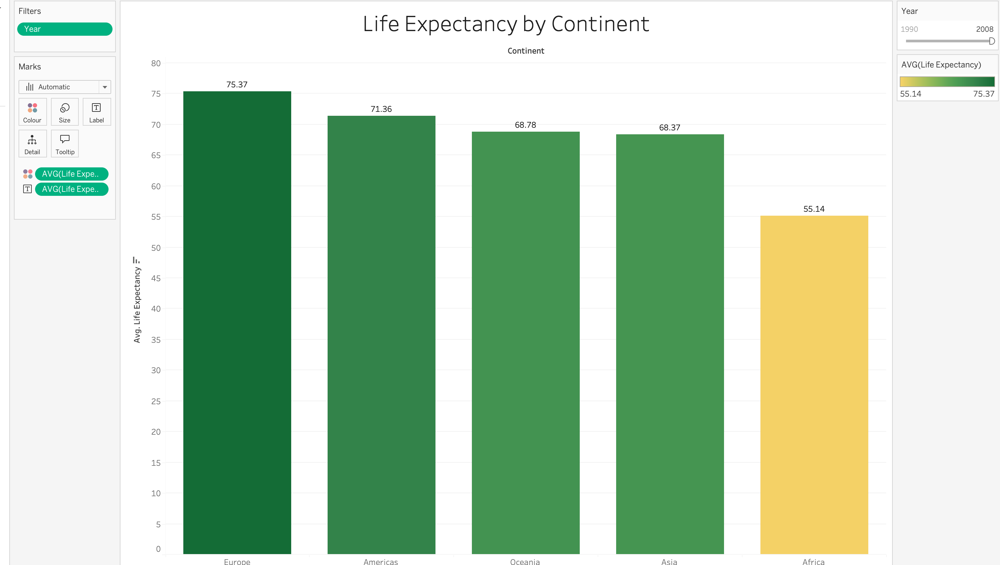
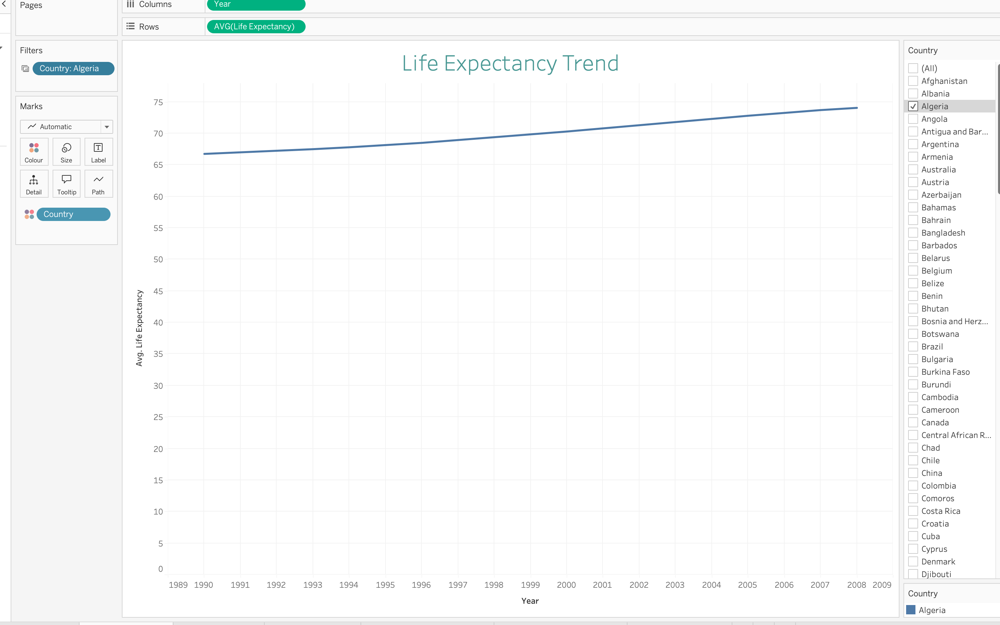
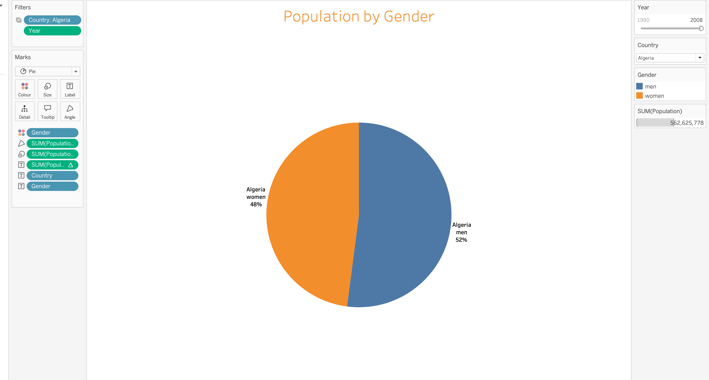
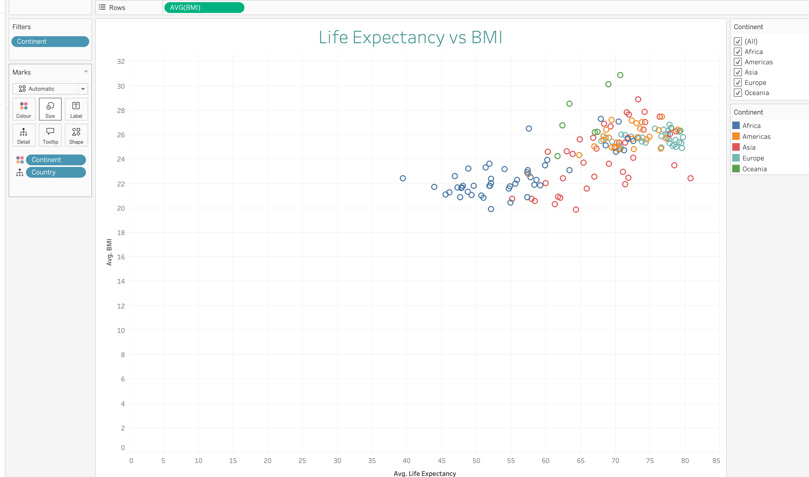

# 🌍  Tableau-Global-Health-Insights-Project
### *A Tableau project exploring global life expectancy, population distribution, and key health indicators*

## 📌 Overview  
**Global Health Insights** is an interactive Tableau dashboard designed to analyze global health trends across countries and continents.  
The project visualizes life expectancy, population demographics, BMI, cholesterol, and other key health metrics, allowing users to explore patterns over time and compare regions through intuitive and interactive charts.

---

## 📊 Visualizations

### **1️⃣ Life Expectancy by Continent (Stacked Bar Chart)**  
A stacked bar chart showing the **average life expectancy across continents**.  
- Includes a **Year filter** to track differences over time  
- Highlights long-term global disparities  

📸 

---

### **2️⃣ Global Life Expectancy Trend (Continuous Line Chart)**  
A continuous line chart illustrating **how life expectancy has changed year by year**.  
- Global average trend  
- **Country filter:** select any country to view its specific trend line  

📸 

---

### **3️⃣ Population by Gender (Pie Chart)**  
A pie chart showing the **distribution of population by gender**.  
- Filters available: **Country** and **Year**  
- Helps identify demographic imbalances  

📸 

---

### **4️⃣ Life Expectancy vs BMI (Scatter Plot)**  
A scatter plot comparing **life expectancy vs BMI**.  
- Includes a **Continent filter** to compare regions  
- Highlights potential correlations between health metrics  

📸 

---

### **5️⃣ Total Cholesterol – Top 5 European Countries (Packed Bubbles)**  
A packed bubble chart displaying **the top 5 European countries with the highest total cholesterol**.  
- Interactive **Continent and Country filters**  
- Great for emphasizing country-level differences within regions  

📸 

---

## 🎛️ Dashboard Interactivity  
The dashboard supports a fully dynamic exploration thanks to:  
✔ **Year filters**  
✔ **Country filters**  
✔ **Continent filters**  
✔ Highlight and hover interactions  
✔ Responsive charts adapting to selected values  

---

## 🧠 Key Insights  
This dashboard helps uncover trends such as:  
- How life expectancy varies across continents  
- Which countries show steady improvement or decline  
- Differences in population structure by gender  
- The relationship between BMI and longevity  
- Cholesterol levels across European countries  

---

## 🛠 Tools Used  
- **Tableau Desktop**  
- **Tableau Public** (for publishing)  
- **Excel / CSV data sources**  
- Basic data cleaning and preparation  

---

## 🚀 Explore the Dashboard  
👉 **View the full interactive dashboard on Tableau Public:**  
🔗 [Tableau profile link](https://public.tableau.com/app/profile/filomena.pedante/viz/Book2_17607391264600/GlobalHealthInsights)

---

## 📧 Contact  
If you'd like to connect, collaborate, or discuss the project, feel free to reach out!

